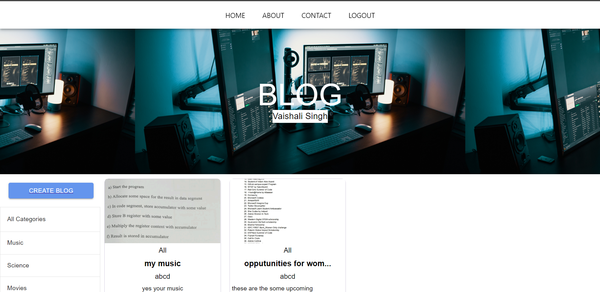

<h1 align="center">BLOG_IT</h1>

 <!-- TABLE OF CONTENTS -->
<details open="open">
  <summary>Table of Contents</summary>
  <ol>
    <li>
      <a href="#about-the-project">About The Project</a>
      <ul>
        <li><a href="#compatible-platforms">Compatible Platforms</a></li>
        <li><a href="#tech-stack">Tech Stack</a></li>
      </ul>
    </li>
       <li>
      <a href="#getting-started">Getting Started</a>
      <ul>
        <li><a href="#installation">Installation</a></li>
      </ul>
    </li>
    <li><a href="#navigating-through-the-app">Navigating through the App</a></li><ul>
        <li><a href="#login">Login and SignUp</a></li>
        <li><a href="#home-page">Home Page</a></li>
        <li><a href="#create-blog">Create a Blog</a></li>
        <li><a href=”#particular-blog”>Particular Blog</a></li>
      </ul>
    
    
  </ol>
</details>

<!-- ABOUT THE PROJECT -->

## ABOUT THE PROJECT
* It is a webApp in which users can create blogs under different categories, can view them in the HomePage and can update/delete their own blogs. Users can also comment on blogs.
* Authentication is done to ensure that only the writer of the post/comment can delete/update their post/comment.
* UI of the webApp  is built using material UI. 


### Compatible Platforms
Laptops and Desktops.

### Tech Stack  
1. Front-end: React.js
2. Back-end: Node.js, Express.js, MongoDB


<!-- INSTALLATIONS -->

## GETTING STARTED
To install and run the project on your local system, clone this repo to your local machine and open command prompt and go to that path:

### Installation
```sh
cd client
npm install
cd server 
npm install
```
* To run it on the local host-

To separately run the application on your local host,run the following command:

```sh
cd client
npm start
cd server 
npm start
```

<!-- APP TUTORIAL-->
## NAVIGATING THROUGH THE APP
### Login and Signup
Registered Users can log in to their account using the username and password and can start creating and viewing blogs. New users can signup using their email.


 
### Home Page-
This page displays all the blogs and categories available. Users can choose to view blogs written by other users by clicking on that particular blog.



### Create a blog-
Users can create blogs by clicking on the ‘Create Blog’ button after choosing a particular category listed on the home page. Users after choosing a suitable title, and description and adding an image can click on the ‘Submit’ button. After submitting, the blog will be displayed on the home page.


### Particular Blog
After clicking on a particular blog,user is redirected to the respective blog wherein the user can comment on blog and if the comment is written by that particular user,he can choose to delete it.Similarly, if the blog is written by that particular user, he can choose to delete/upadate the blog. 


